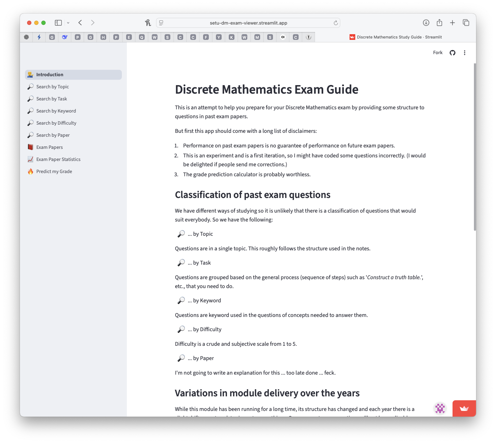
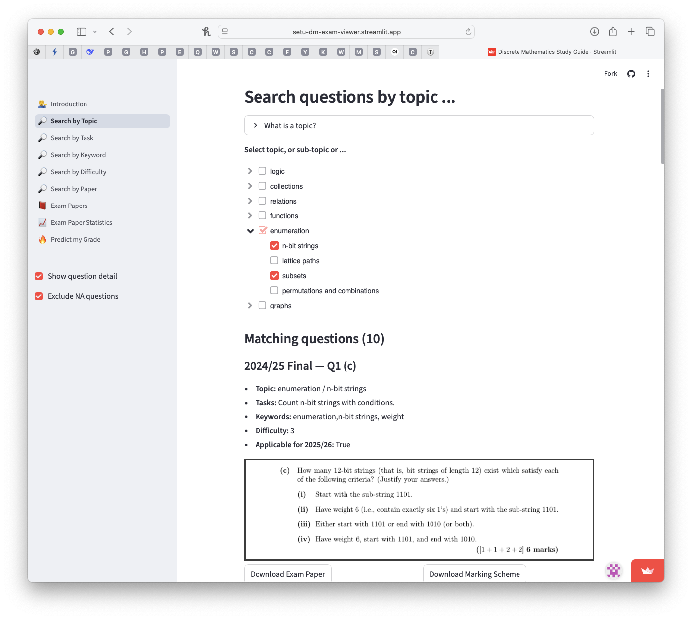
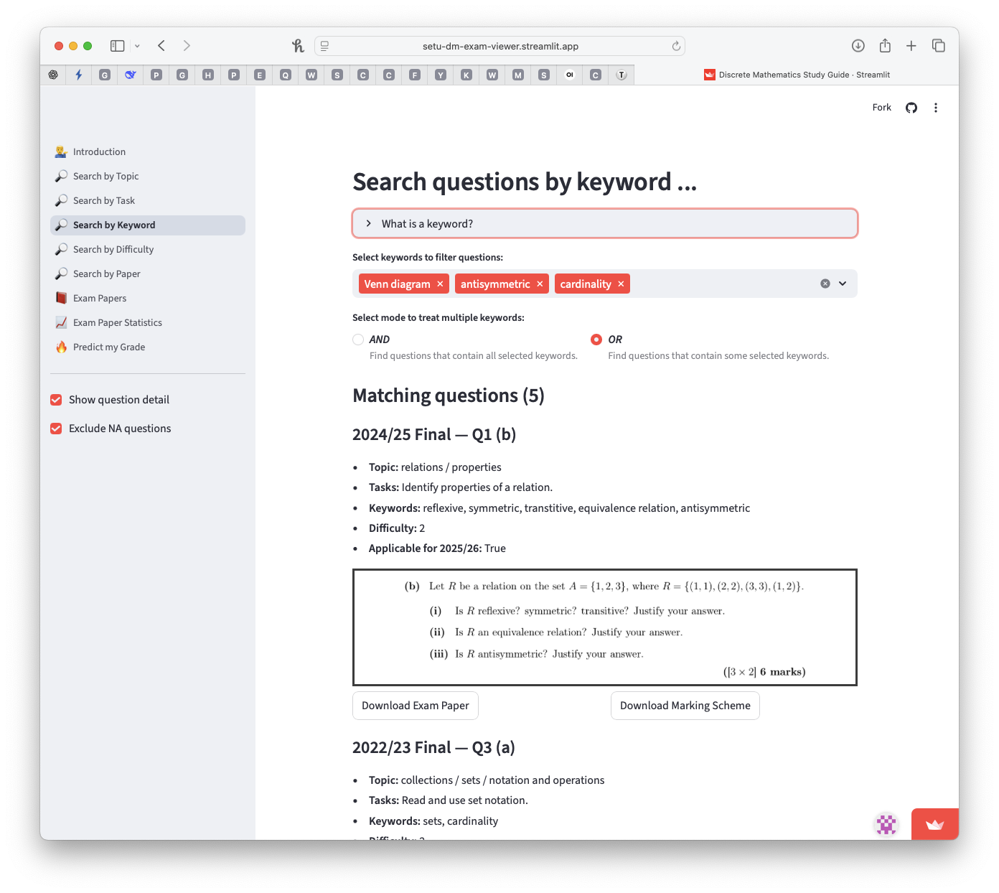

# CA1 - Exam Viewer

## Aim of Assignment

Develop a Studyclix-like website to help students prepare for Discrete Mathematics exams. Idealy the webside/dashboard should:

* Allow viewing/searching of multiple exam papers.

* Filter by topic, by keyword, by difficulty, by ...
  * shows each of the questions that matches the selection criteria and any other helpful information.

The following are screenshots of my attempt at this, to help give you context. Your job is not to just reproduce what I did but take the idea and see how far you can push it. 

<figure>
 
 <figcaption>Possible structure of exam viewer dashboard.</figcaption>
</figure>

<figure>
 
 <figcaption>Possible filtering by topic.</figcaption>
</figure>

<figure>
 
 <figcaption>Possible filtering by keyword.</figcaption>
</figure>

## Implementation

In contrast to other assignments I want to give you maxium freedom to decide how carry out this implemention.  

At a minimum you need some way to generate a dashboard and parse PDFs. For these two subtasks, I used the following but feel free to use alterantives:

* Website is a dsahbord based on [streamlit](https://streamlit.io/) but other options are 
[gradio](https://github.com/gradio-app/gradio), or [niceGUI](https://nicegui.io/).

* Parsing of PDF documents using [pymupdf](https://github.com/pymupdf/PyMuPDF). There are many other python based PDF parsers so you might find a more suitable option.

I'm intentionally leaving awful lot out &mdash; such as how to preprocess exams papers  &mdash; this is all up to you.

## Deliverable

This assignment will be managd using github (instead of Moodle) so I can see progress.

Draft rubric for grading is given [here](rubric.md)